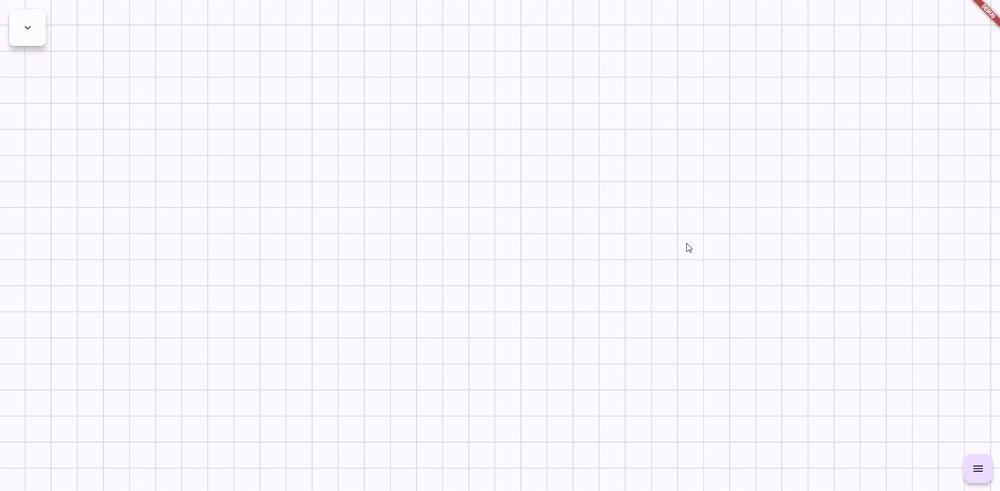
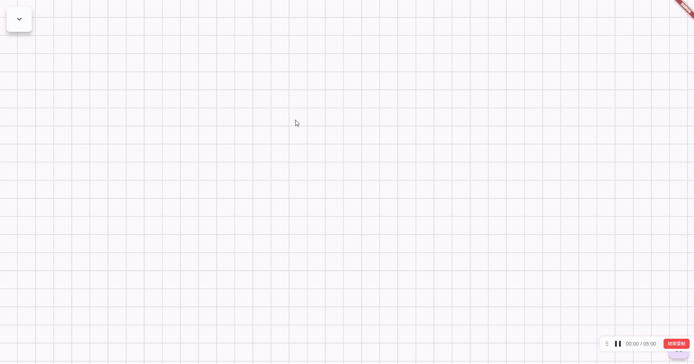

# Flow Compose

`1.0.0` is a port-based workflow canvas for Flutter. It provides a component
palette, a configuration inspector, pan and zoom, and directional Bezier edges.
Edges persist node and port IDs instead of screen coordinates, so they remain
correct after a node moves or a component changes its size.

```dart
final controller = FlowController();

controller.registerNode(
  FlowNodeDefinition(
    type: 'httpRequest',
    title: 'HTTP request',
    description: 'Fetch data from an API.',
    inputs: const [
      FlowPort(id: 'url', label: 'URL', kind: FlowPortKind.input),
    ],
    outputs: const [
      FlowPort(id: 'body', label: 'Response', kind: FlowPortKind.output),
    ],
    initialData: const {'method': 'GET'},
    canvasBuilder: (context, node) => Text(node.data['method'] as String),
    configurationBuilder: (context, node, updateData) {
      return SwitchListTile(
        title: const Text('Use cache'),
        value: node.data['cache'] == true,
        onChanged: (value) => updateData({...node.data, 'cache': value}),
      );
    },
  ),
);

FlowCanvas(controller: controller)
```

`FlowNodeDefinition` is the single registration point for a business component:
its palette identity, canvas content, port contract, default data, and inspector
form all live together. See `example/lib/main.dart` for four complete node
definitions and a pre-wired workflow.

The old `InfiniteDrawingBoard` API remains exported temporarily for migration,
but new integrations should use `FlowCanvas` and `FlowController`.

Try it here 👉 [Flow Compose Demo](https://guchengxi1994.github.io/flow_compose/)

This project is inspired by [flutter_flow_chart](https://github.com/alnitak/flutter_flow_chart), and aims to become a tool for building flowcharts for AI agents and other use cases.

> ⚠️ **Note:** This project is in its early stage and **not ready for production use**.  
> It is a **frontend-only** package.





