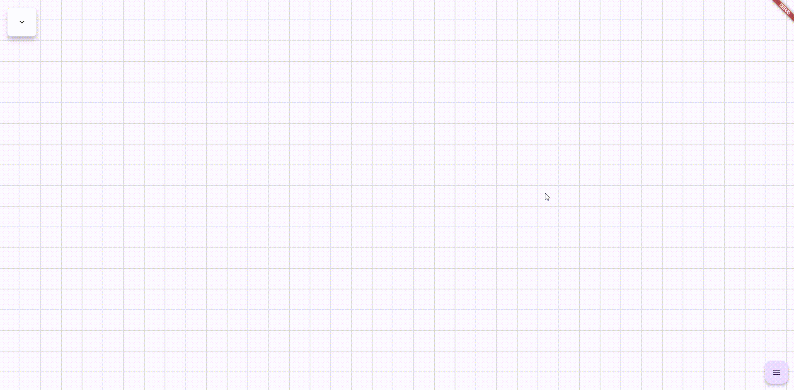

# Flow Chart Editor for Flutter

Try it here 👉 [Flow Compose Demo](https://guchengxi1994.github.io/flow_compose/)

This project is inspired by [flutter_flow_chart](https://github.com/alnitak/flutter_flow_chart), and aims to become a tool for building flowcharts for AI agents and other use cases.

> ⚠️ **Note:** This project is in its early stage and **not ready for production use**.  
> It is a **frontend-only** package.

